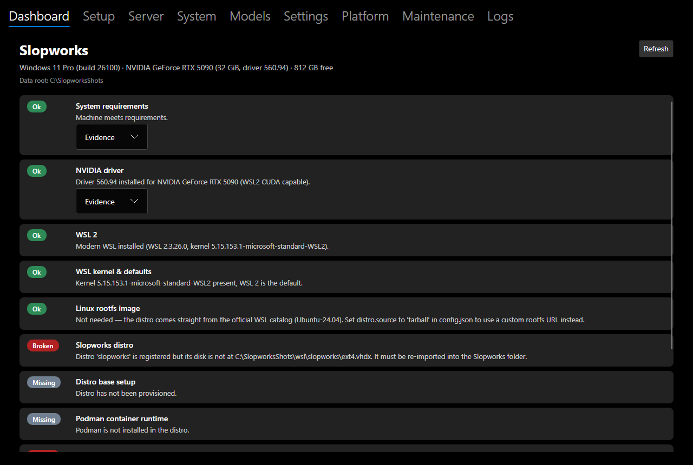
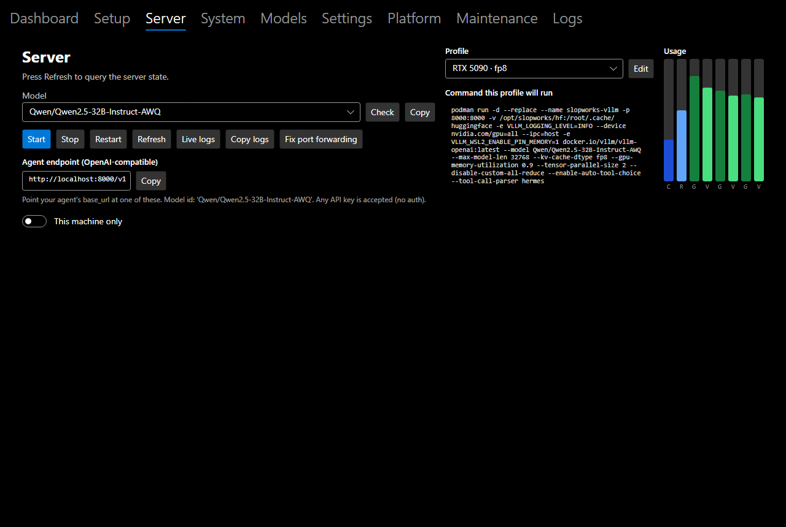
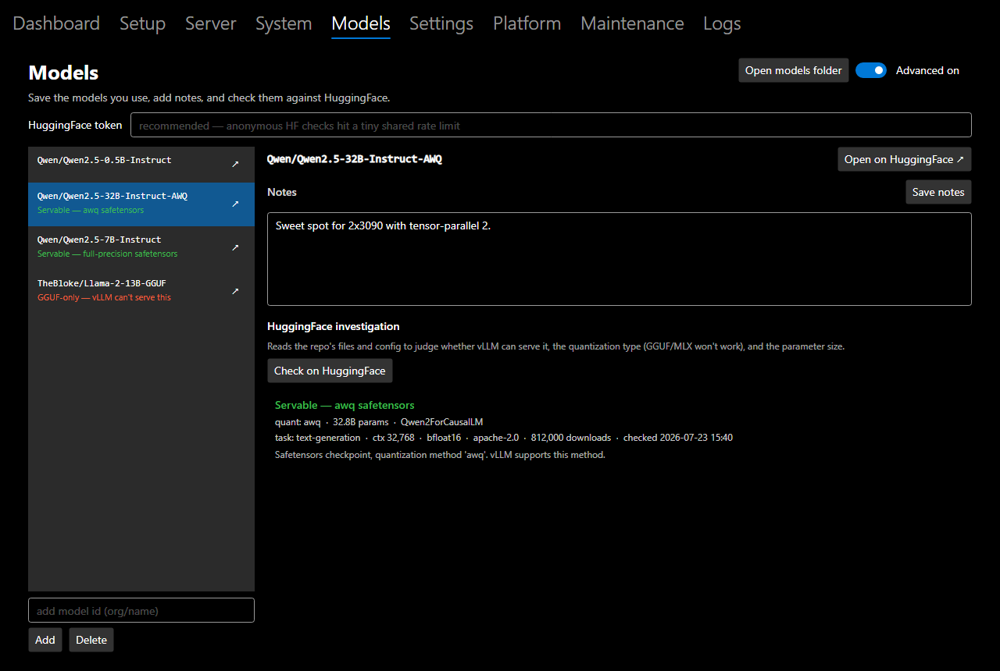
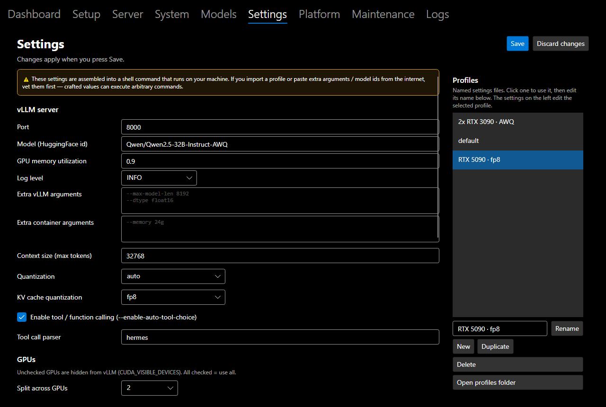
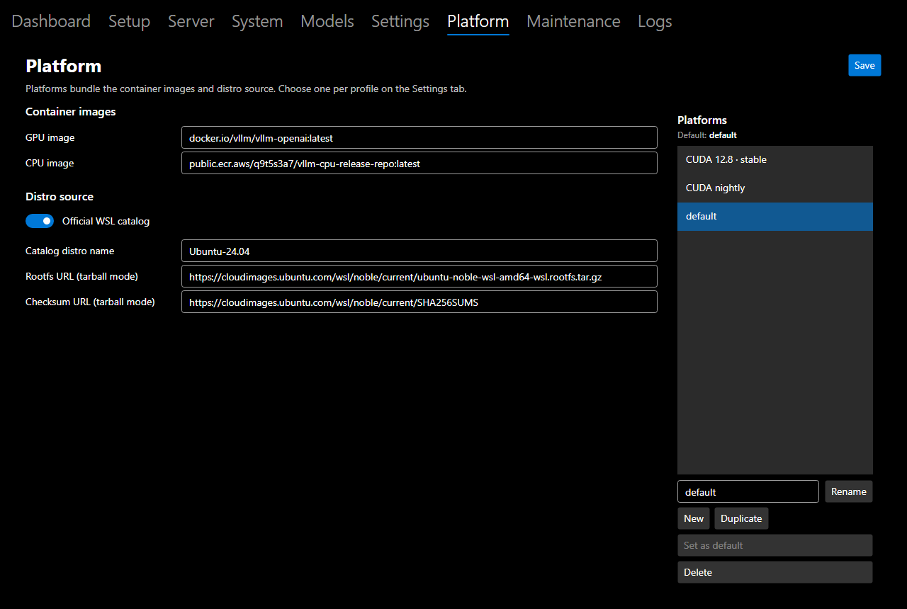
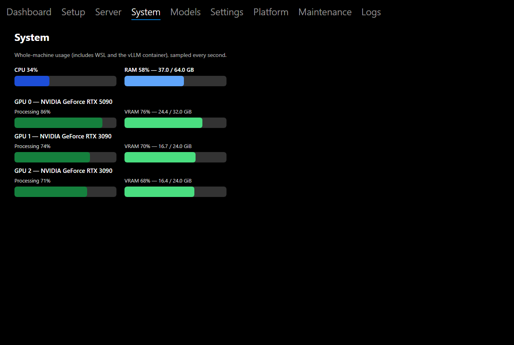
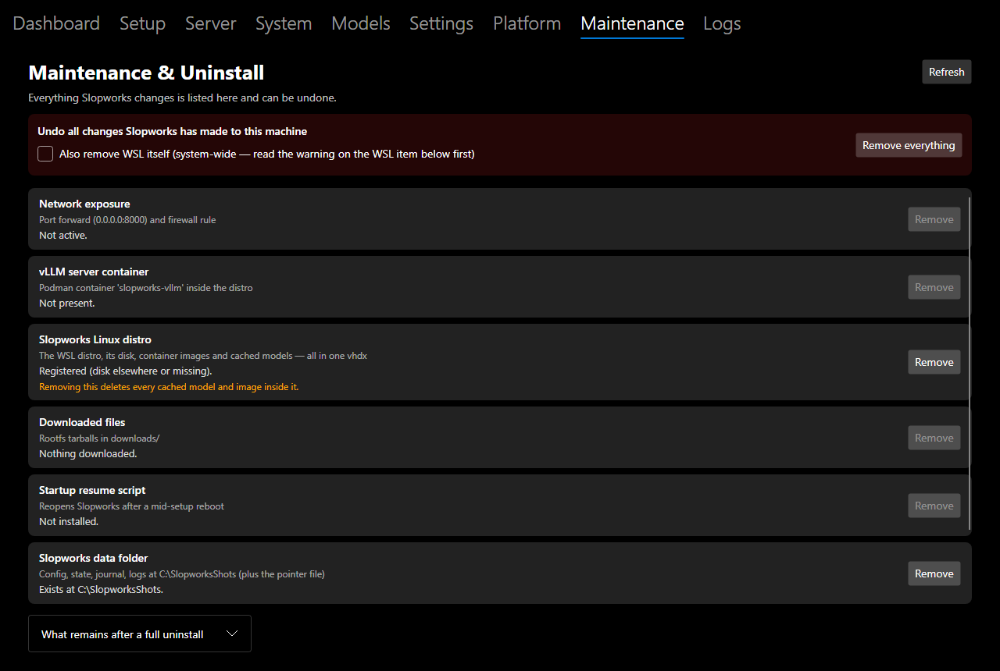

# Slopworks

A desktop tool that sets up everything needed to run [vLLM](https://github.com/vllm-project/vllm)
on a Windows or Ubuntu machine — and then manages the running server.

vLLM has no native Windows support. On Windows, Slopworks converges your machine to the one
path that works well: WSL2 → a dedicated, self-contained Linux distro → Podman → the official
`vllm/vllm-openai` container image, serving an OpenAI-compatible API on `localhost`. On Ubuntu
the host is the Linux environment, so it goes straight to rootless Podman + the NVIDIA
container toolkit.

## Screenshots

| | |
|---|---|
|  |  |
|  |  |
|  |  |
|  | |

- **Dashboard** — each setup step's live state (Missing / Partial / Broken / Ok), with evidence and one-click overrides.
- **Server** — pick a saved model, preview the exact command the active profile will run, copy the OpenAI-compatible endpoint, and watch compact CPU/GPU usage bars.
- **Models** — a library of the models you use, with notes; check any repo against HuggingFace for vLLM-suitability, quantization type, parameter size and more.
- **Settings** — every vLLM/container knob with a live command preview, plus named settings **profiles** and a platform selector.
- **Platform** — named bundles of container images + distro source; each profile picks one (or the default).
- **System** — whole-machine CPU/RAM and per-GPU processing/VRAM.
- **Maintenance** — every change Slopworks made to the machine, undone individually or all at once.

## Principles

- **Convergent, not scripted.** Every setup step detects its current state
  (Missing / Partial / Broken / Ok) and plans only the actions needed to reach Ok.
  Repair is the same operation as install. Partially broken setups are fixed, not
  reinstalled from scratch.
- **One directory.** Config, state, downloads, logs, and the entire Linux distro
  (a single `ext4.vhdx`) live under one root folder. Uninstall removes everything —
  optionally including WSL itself, with warnings when it is in use by other systems.
- **Safe by default.** Every external effect (command, download, system change) is shown
  verbatim for approval before it runs. Auto mode — one toggle — approves everything for
  unattended setup.
- **No host Python or Node.js.** Everything language-runtime-shaped stays inside the container.
- **Every endpoint overridable.** Download URLs come from config; GitHub-hosted artifacts
  can be auto-resolved to the latest release.

## Getting started

1. **Run automatic setup.** On the **Dashboard** (or **Setup**) tab, start setup. Slopworks
   detects what's missing and converges the machine — WSL2, a self-contained Linux distro,
   Podman, the NVIDIA container toolkit, and the vLLM image. **Auto mode** runs it unattended;
   safe mode shows each command for approval. Re-run any time to repair.
2. **Configure a model.** On the **Models** tab, add the HuggingFace id of the model you want
   (e.g. `Qwen/Qwen2.5-32B-Instruct-AWQ`) and press **Check on HuggingFace** to confirm vLLM can
   serve it (safetensors + a supported quant — GGUF/MLX won't work) and see its size. The
   selected model is the one the server runs.
3. **Configure vLLM settings.** On the **Settings** tab, tune the run — quantization, context
   size, KV-cache dtype, tensor-parallel across GPUs, extra vLLM/container args, and which
   **platform** (container image + distro) to use. The live command preview shows exactly what
   will run; save named **profiles** to switch between setups.
4. **Run.** On the **Server** tab, press **Start**. The container pulls the model on first run
   (can take a few minutes) and serves an OpenAI-compatible API — watch the live logs and the
   usage bars.
5. **Point an agent at the endpoint.** Copy the endpoint from the Server tab —
   `http://localhost:8000/v1` — and set your agent/client's `base_url` to it, using the
   configured model id. Any API key is accepted (no auth); toggle **Open to network** to reach
   it from other machines.

## License

MIT — see [LICENSE](LICENSE). Third-party software that Slopworks downloads or invokes at
setup time (Ubuntu, Podman, NVIDIA toolkit, vLLM, models) is licensed by its respective
owners and is never bundled with Slopworks.
